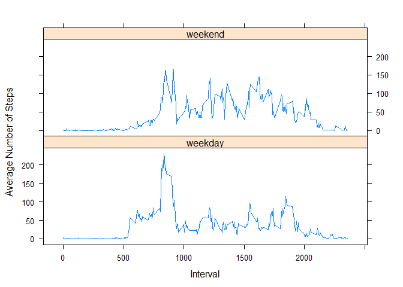

# Reproducible Research: Assignment 1
November 10, 2015  

## 1. Activity Monitoring Data
#### Source: https://d396qusza40orc.cloudfront.net/repdata%2Fdata%2Factivity.zip

Always write code so that someone will be able to read the code


## 2. Loading & Preprocessing Data
### 2.1 Loading Data

```r
activity_monitoring_data_URL <-"https://d396qusza40orc.cloudfront.net/repdata/data/activity.zip"
activity_monitoring_data_file <- "activity.zip"
if(!file.exists(activity_monitoring_data_file)) {
  download.file(activity_monitoring_data, destfile = activity_monitoring_data_file)
  unzip(activity_monitoring_data_file)
}

a <- read.csv("activity.csv", sep =",", na.strings = "NA", header = TRUE)

dim(a)
```

```
## [1] 17568     3
```

```r
head(a)
```

```
##   steps       date interval
## 1    NA 2012-10-01        0
## 2    NA 2012-10-01        5
## 3    NA 2012-10-01       10
## 4    NA 2012-10-01       15
## 5    NA 2012-10-01       20
## 6    NA 2012-10-01       25
```


### 2.2 Process Data

Expected Output: Single Markdown file
process by knitr and transform to HTML
Always include the code generated echo = TRUE


```r
CompleteValues <- complete.cases(a)
aa <- a[CompleteValues == T,]

head(aa)  # Cleaned Data
```

```
##     steps       date interval
## 289     0 2012-10-02        0
## 290     0 2012-10-02        5
## 291     0 2012-10-02       10
## 292     0 2012-10-02       15
## 293     0 2012-10-02       20
## 294     0 2012-10-02       25
```

## 3. Mean total number of steps taken per day
### 3.1 Total # of steps per day

```r
StepsByDay <- aggregate(aa$steps ~ aa$date, FUN = sum)
```

### 3.2 Histogram of the total Number of Steps per day

```r
colnames(StepsByDay) <- c("steps.by.day", "steps.total")
str(StepsByDay)
```

```
## 'data.frame':	53 obs. of  2 variables:
##  $ steps.by.day: Factor w/ 61 levels "2012-10-01","2012-10-02",..: 2 3 4 5 6 7 9 10 11 12 ...
##  $ steps.total : int  126 11352 12116 13294 15420 11015 12811 9900 10304 17382 ...
```

```r
par(mfrow=c(1,1))
hist(StepsByDay$steps.total, 
     main = "Total Number of steps taken each day", 
     xlab = "Steps per Day", ylab = "Frequency", col="green")
```

 

### 3.3 Report of mean and median of the total number of steps taken per day

```r
sprintf("Mean of the total number of steps taken per day is %f", 
        mean(StepsByDay$steps.total))
```

```
## [1] "Mean of the total number of steps taken per day is 10766.188679"
```

```r
sprintf("Median of the total number of steps taken per day is %f", 
        median(StepsByDay$steps.total))
```

```
## [1] "Median of the total number of steps taken per day is 10765.000000"
```

## 4. Average Daily Activity Pattern
A time series plot (i.e. type = "l" ) of the 5 minute interval (x-axis) and the average number of steps taken, averaged across all days (y-axis)

```r
daily_activity <- aggregate(aa$steps ~ aa$interval, FUN = mean)
colnames(daily_activity) = c("steps.interval", "steps")
par(mar = c(5,4,2,2))
with(daily_activity, plot(steps.interval, steps, type = "l", col = "blue", ylab = "Average Steps Across All Days", xlab = "Interval"))
title(main = "Average Daily Activity Pattern")
```

 

```r
sprintf( "5 minute interval, on average across all the days in the dataset, containing the maximum number of steps = %d",
            daily_activity[daily_activity$steps == max(daily_activity$steps),]$steps.interval)
```

```
## [1] "5 minute interval, on average across all the days in the dataset, containing the maximum number of steps = 835"
```

## 5. Imputing Missing values
### 5.1 Missing values in the dateset

```r
MissingValues <- a[CompleteValues == F,]
sprintf("Total number of missing rows in the data set is %d", nrow(MissingValues))
```

```
## [1] "Total number of missing rows in the data set is 2304"
```

### 5.2 Fill missing values and create a new data aset with the missing values filled in

```r
intersect(unique(MissingValues$date),unique(StepsByDay$steps.by.day))
```

```
## character(0)
```

```r
length(intersect(unique(MissingValues$interval),unique(aa$interval)))
```

```
## [1] 288
```

Either values are present for the entire day or missing for the entire day. Hence take the mean of the 5-minute interval as a strategy to to fill missing values


```r
StepsByInterval <- with(aa, aggregate(steps ~ interval, FUN = mean))

aaa <- merge(a, StepsByInterval, by = c("interval", "interval"))
colnames(aaa) <- c("interval", "steps", "date", "steps.mean")
```

New dataset (new_a) equal to original dataset but with the missing data filled in:

```r
suppressMessages(library(dplyr))
new_a <- transmute(aaa, date, interval, steps = ifelse(is.na(steps), steps.mean, steps))
```

### 5.3 Histogram of the total # of steps taken each day (missing values filled in)

```r
new_StepsByDay <- aggregate(new_a$steps ~ new_a$date, FUN = sum)
colnames(new_StepsByDay) <- c("steps.by.day", "steps.total")
par(mfrow=c(1,1))
hist(new_StepsByDay$steps.total,
      main = "Total Number of steps taken each day (missing values filled)",
      xlab = "Steps per Day", ylab = "Frequency", col="yellow")
```

 

```r
sprintf("Mean of the total number of steps taken per day is %f", 
        mean(new_StepsByDay$steps.total))
```

```
## [1] "Mean of the total number of steps taken per day is 10766.188679"
```

```r
sprintf("Median of the total number of steps taken per day is %f", 
        median(new_StepsByDay$steps.total))
```

```
## [1] "Median of the total number of steps taken per day is 10766.188679"
```
Mean and median pretty much remains the same even after imputing the missing data


### Impact of imputing missing values

```r
par(mfrow = c(1,2), cex.main = 0.65, mar = c(5,4,2,2))
hist(StepsByDay$steps.total, 
     col="green", breaks = 5, ylim = c(0,35),
     main = "Total Number of steps taken each day",
     xlab = "Steps per Day", ylab = "Frequency" )
hist(new_StepsByDay$steps.total,
     breaks = 5, ylim = c(0,35), col="yellow", 
      main = "Total Number of steps taken each day (missing values filled)",
      xlab = "Steps per Day", ylab = "Frequency" )
```

 

* There is no impact of imputing missing data values. One observation is that the number of steps for  majority of the missing data falls in the mid-range


## 6. Differences in activity patterns between weekdays and weekends

```r
day_steps <- transform(new_a, 
          day = ifelse(strftime(date, "%A") %in% c("Sunday", "Saturday"), "weekend", "weekday"))

ap <- day_steps %>% group_by(interval,day) %>% summarize(steps = mean(steps))
library(lattice)
par(mar = c(5,4,2,2))
xyplot(steps ~ interval | day, data = ap, type = "l",  layout = c(1,2), ylab = "Average Number of Steps", xlab = "Interval")
```

 

