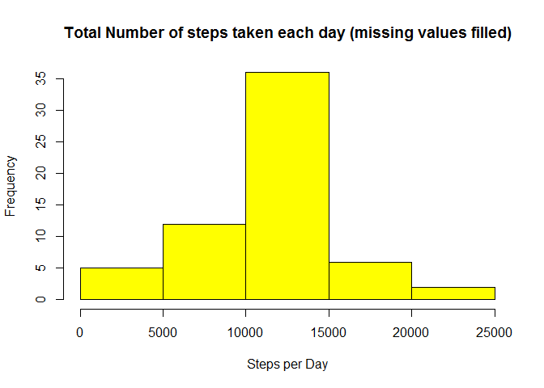
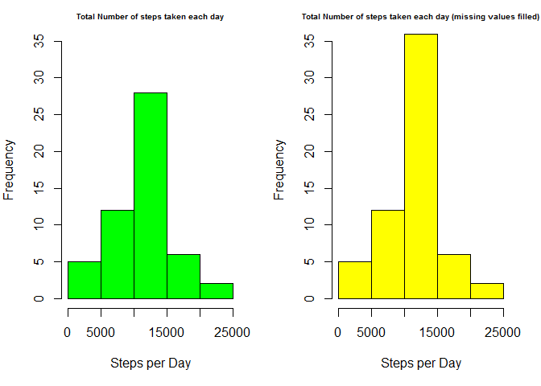

# Reproducible Research: Assignment 1
November 10, 2015  

## 1. Activity Monitoring Data
#### Source: https://d396qusza40orc.cloudfront.net/repdata%2Fdata%2Factivity.zip

Always write code so that someone will be able to read the code


## 2. Loading & Preprocessing Data
### 2.1 Loading Data

```r
activity_monitoring_data_URL <-"https://d396qusza40orc.cloudfront.net/repdata/data/activity.zip"
activity_monitoring_data_file <- "activity.zip"
if(!file.exists(activity_monitoring_data_file)) {
  download.file(activity_monitoring_data, destfile = activity_monitoring_data_file)
  unzip(activity_monitoring_data_file)
}

a <- read.csv("activity.csv", sep =",", na.strings = "NA", header = TRUE)

dim(a)
```

```
## [1] 17568     3
```

```r
head(a)
```

```
##   steps       date interval
## 1    NA 2012-10-01        0
## 2    NA 2012-10-01        5
## 3    NA 2012-10-01       10
## 4    NA 2012-10-01       15
## 5    NA 2012-10-01       20
## 6    NA 2012-10-01       25
```


### 2.2 Process Data

Expected Output: Single Markdown file
process by knitr and transform to HTML
Always include the code generated echo = TRUE


```r
CompleteValues <- complete.cases(a)
aa <- a[CompleteValues == T,]

head(aa)  # Cleaned Data
```

```
##     steps       date interval
## 289     0 2012-10-02        0
## 290     0 2012-10-02        5
## 291     0 2012-10-02       10
## 292     0 2012-10-02       15
## 293     0 2012-10-02       20
## 294     0 2012-10-02       25
```

## 3. Mean total number of steps taken per day
### 3.1 Total # of steps per day

```r
StepsByDay <- aggregate(aa$steps ~ aa$date, FUN = mean)
```

### 3.2 Histogram of the total Number of Steps per day

```r
colnames(StepsByDay) <- c("steps.by.day", "steps.mean")
str(StepsByDay)
```

```
## 'data.frame':	53 obs. of  2 variables:
##  $ steps.by.day: Factor w/ 61 levels "2012-10-01","2012-10-02",..: 2 3 4 5 6 7 9 10 11 12 ...
##  $ steps.mean  : num  0.438 39.417 42.069 46.16 53.542 ...
```

```r
hist(StepsByDay$steps.mean, 
     main = "Total Number of steps taken each day",
     xlab = "Steps per Day", ylab = "Frequency", col="green")
```

 

```r
summary(aa)
```

```
##      steps                date          interval     
##  Min.   :  0.00   2012-10-02:  288   Min.   :   0.0  
##  1st Qu.:  0.00   2012-10-03:  288   1st Qu.: 588.8  
##  Median :  0.00   2012-10-04:  288   Median :1177.5  
##  Mean   : 37.38   2012-10-05:  288   Mean   :1177.5  
##  3rd Qu.: 12.00   2012-10-06:  288   3rd Qu.:1766.2  
##  Max.   :806.00   2012-10-07:  288   Max.   :2355.0  
##                   (Other)   :13536
```

### 3.3 Report of mean and median of the total number of steps taken per day

```r
library(dplyr)
```

```
## 
## Attaching package: 'dplyr'
## 
## The following objects are masked from 'package:stats':
## 
##     filter, lag
## 
## The following objects are masked from 'package:base':
## 
##     intersect, setdiff, setequal, union
```

```r
StepsByDay
```

```
##    steps.by.day steps.mean
## 1    2012-10-02  0.4375000
## 2    2012-10-03 39.4166667
## 3    2012-10-04 42.0694444
## 4    2012-10-05 46.1597222
## 5    2012-10-06 53.5416667
## 6    2012-10-07 38.2465278
## 7    2012-10-09 44.4826389
## 8    2012-10-10 34.3750000
## 9    2012-10-11 35.7777778
## 10   2012-10-12 60.3541667
## 11   2012-10-13 43.1458333
## 12   2012-10-14 52.4236111
## 13   2012-10-15 35.2048611
## 14   2012-10-16 52.3750000
## 15   2012-10-17 46.7083333
## 16   2012-10-18 34.9166667
## 17   2012-10-19 41.0729167
## 18   2012-10-20 36.0937500
## 19   2012-10-21 30.6284722
## 20   2012-10-22 46.7361111
## 21   2012-10-23 30.9652778
## 22   2012-10-24 29.0104167
## 23   2012-10-25  8.6527778
## 24   2012-10-26 23.5347222
## 25   2012-10-27 35.1354167
## 26   2012-10-28 39.7847222
## 27   2012-10-29 17.4236111
## 28   2012-10-30 34.0937500
## 29   2012-10-31 53.5208333
## 30   2012-11-02 36.8055556
## 31   2012-11-03 36.7048611
## 32   2012-11-05 36.2465278
## 33   2012-11-06 28.9375000
## 34   2012-11-07 44.7326389
## 35   2012-11-08 11.1770833
## 36   2012-11-11 43.7777778
## 37   2012-11-12 37.3784722
## 38   2012-11-13 25.4722222
## 39   2012-11-15  0.1423611
## 40   2012-11-16 18.8923611
## 41   2012-11-17 49.7881944
## 42   2012-11-18 52.4652778
## 43   2012-11-19 30.6979167
## 44   2012-11-20 15.5277778
## 45   2012-11-21 44.3993056
## 46   2012-11-22 70.9270833
## 47   2012-11-23 73.5902778
## 48   2012-11-24 50.2708333
## 49   2012-11-25 41.0902778
## 50   2012-11-26 38.7569444
## 51   2012-11-27 47.3819444
## 52   2012-11-28 35.3576389
## 53   2012-11-29 24.4687500
```

```r
summarize(StepsByDay, steps.median = median(StepsByDay$steps.mean))
```

```
##   steps.median
## 1     37.37847
```

## 4. Average Daily Activity Pattern
A time series plot (i.e. type = "l" ) of the 5minute interval (x-axis) and the average number of steps taken, averaged across all days (y-axis)

```r
daily_activity <- aggregate(aa$steps ~ aa$interval, FUN = mean)
colnames(daily_activity) = c("steps.interval", "steps")
par(mar = c(5,4,2,2))
with(daily_activity, plot(steps.interval, steps, type = "l", col = "blue", ylab = "Average Steps Across All Days", xlab = "Interval"))
title(main = "Average Daily Activity Pattern")
```

 

```r
sprintf( "5 minute interval, on average across all the days in the dataset, containing the maximum number of steps = %d",
            daily_activity[daily_activity$steps == max(daily_activity$steps),]$steps.interval)
```

```
## [1] "5 minute interval, on average across all the days in the dataset, containing the maximum number of steps = 835"
```

## 5. Imputing Missing values
### 5.1 Missing values in the dateset

```r
MissingValues <- a[CompleteValues == F,]
sprintf("Total number of missing rows in the data set is %d", nrow(MissingValues))
```

```
## [1] "Total number of missing rows in the data set is 2304"
```

### 5.2 Fill missing values

```r
intersect(unique(MissingValues$date),unique(StepsByDay$steps.by.day))
```

```
## character(0)
```

```r
length(intersect(unique(MissingValues$interval),unique(aa$interval)))
```

```
## [1] 288
```

```r
StepsByInterval <- with(aa, aggregate(steps ~ interval, FUN = mean))

# Fill Missing values
aaa <- merge(a, StepsByInterval, by = c("interval", "interval"))
colnames(aaa) <- c("interval", "steps", "date", "steps.mean")
new_a <- transmute(aaa, date, interval, steps = ifelse(is.na(steps), steps.mean, steps))
```

### 5.3 Create a new data set with but with the missing data values filled in

```r
new_daily_steps <- aggregate(new_a$steps ~ new_a$date, FUN = mean)
new_daily_steps
```

```
##    new_a$date new_a$steps
## 1  2012-10-01  37.3825996
## 2  2012-10-02   0.4375000
## 3  2012-10-03  39.4166667
## 4  2012-10-04  42.0694444
## 5  2012-10-05  46.1597222
## 6  2012-10-06  53.5416667
## 7  2012-10-07  38.2465278
## 8  2012-10-08  37.3825996
## 9  2012-10-09  44.4826389
## 10 2012-10-10  34.3750000
## 11 2012-10-11  35.7777778
## 12 2012-10-12  60.3541667
## 13 2012-10-13  43.1458333
## 14 2012-10-14  52.4236111
## 15 2012-10-15  35.2048611
## 16 2012-10-16  52.3750000
## 17 2012-10-17  46.7083333
## 18 2012-10-18  34.9166667
## 19 2012-10-19  41.0729167
## 20 2012-10-20  36.0937500
## 21 2012-10-21  30.6284722
## 22 2012-10-22  46.7361111
## 23 2012-10-23  30.9652778
## 24 2012-10-24  29.0104167
## 25 2012-10-25   8.6527778
## 26 2012-10-26  23.5347222
## 27 2012-10-27  35.1354167
## 28 2012-10-28  39.7847222
## 29 2012-10-29  17.4236111
## 30 2012-10-30  34.0937500
## 31 2012-10-31  53.5208333
## 32 2012-11-01  37.3825996
## 33 2012-11-02  36.8055556
## 34 2012-11-03  36.7048611
## 35 2012-11-04  37.3825996
## 36 2012-11-05  36.2465278
## 37 2012-11-06  28.9375000
## 38 2012-11-07  44.7326389
## 39 2012-11-08  11.1770833
## 40 2012-11-09  37.3825996
## 41 2012-11-10  37.3825996
## 42 2012-11-11  43.7777778
## 43 2012-11-12  37.3784722
## 44 2012-11-13  25.4722222
## 45 2012-11-14  37.3825996
## 46 2012-11-15   0.1423611
## 47 2012-11-16  18.8923611
## 48 2012-11-17  49.7881944
## 49 2012-11-18  52.4652778
## 50 2012-11-19  30.6979167
## 51 2012-11-20  15.5277778
## 52 2012-11-21  44.3993056
## 53 2012-11-22  70.9270833
## 54 2012-11-23  73.5902778
## 55 2012-11-24  50.2708333
## 56 2012-11-25  41.0902778
## 57 2012-11-26  38.7569444
## 58 2012-11-27  47.3819444
## 59 2012-11-28  35.3576389
## 60 2012-11-29  24.4687500
## 61 2012-11-30  37.3825996
```

```r
colnames(new_daily_steps) <- c("date", "steps.mean")
```

### 5.4 Histogram of the total # of steps taken eacy day (missing values filled in)

```r
hist(new_daily_steps$steps.mean,
      main = "Total Number of steps taken each day (missing values filled)",
      xlab = "Steps per Day", ylab = "Frequency", col="yellow")
```

 

```r
summarize(new_daily_steps, steps.median = median(new_daily_steps$steps.mean))
```

```
##   steps.median
## 1      37.3826
```

### Impact of imputing missing values

```r
par(mfrow = c(1,2), mar = c(5,4,2,2))
hist(StepsByDay$steps.mean, 
     main = "Total Number of steps taken each day",
     xlab = "Steps per Day", ylab = "Frequency", col="green")
hist(new_daily_steps$steps.mean,
      main = "Total Number of steps taken each day (missing values filled)",
      xlab = "Steps per Day", ylab = "Frequency", col="yellow")
```

 

## 6. Differences in activity patterns between weekdays and weekends

```r
day_steps <- transform(new_a, 
          day = ifelse(strftime(date, "%A") %in% c("Sunday", "Saturday"), "weekend", "weekday"))
library(lattice)
par(mar = c(5,4,2,2))
xyplot(steps ~ interval | day, data = day_steps, type = "l",  layout = c(1,2), ylab = "Number of Steps", xlab = "Interval")
```

 
